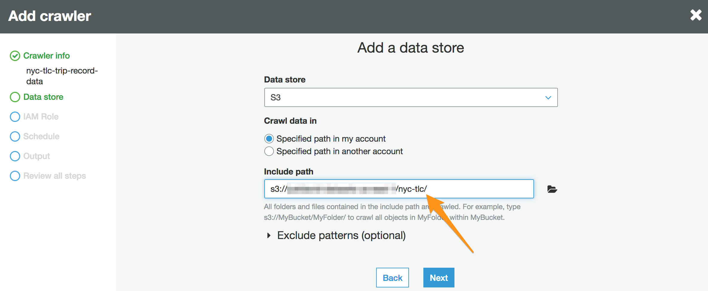
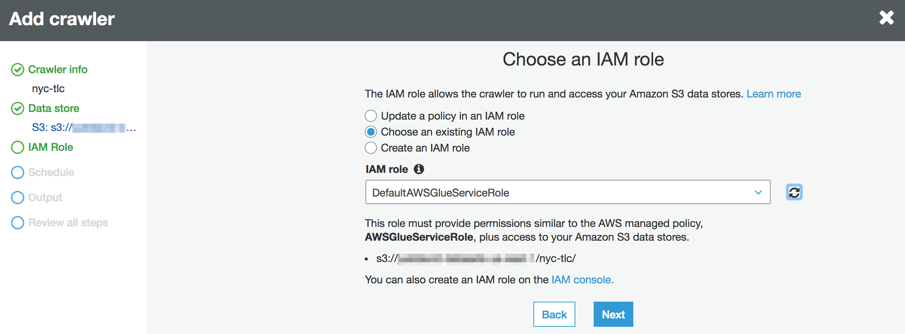
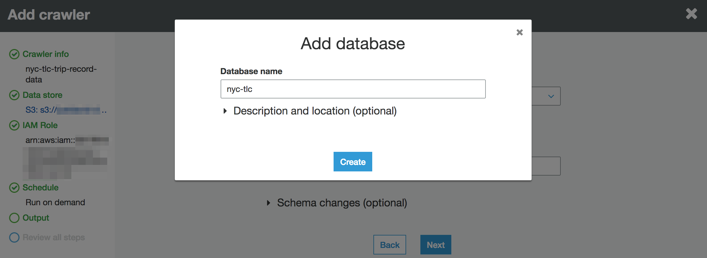
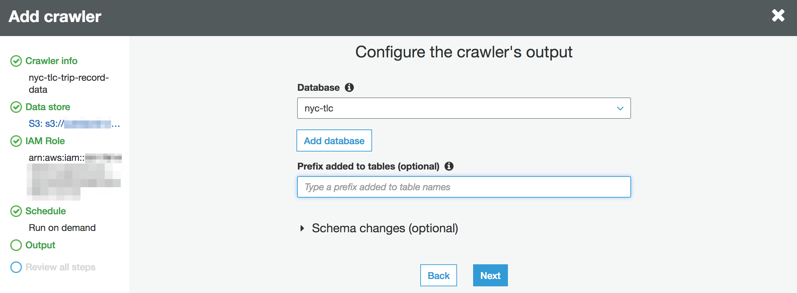
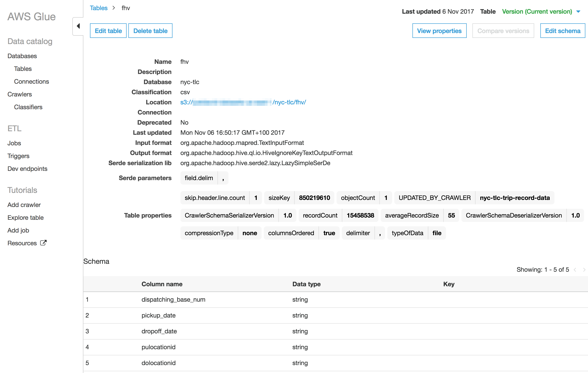

## Create the data catalog

In this step, you are going to leverage [AWS Glue](https://aws.amazon.com/glue/) to automatically create the data catalog for you. With AWS Glue you simply point to where your data are stored, and AWS Glue discovers the data and stores table definitions and schemas in the AWS Glue Data Catalog.

1. Navigate to the [AWS Glue management console](https://console.aws.amazon.com/glue/home). Make sure the AWS Region selector matches the one you have been working with so far. If you see a welcome page click **Get started**.

1. In the navigation pane on the left, click on the **Crawlers** link.

1. Click **Add Crawler**

	
	
1. Set the crawler name to `nyc-tlc-trip-record-data` and click **Next**

	
	
1. Select `S3` as Data store. Specify the path to the your bucket where raw data files reside `s3://<workshop-bucket>/data/nyc-tlc/` and click **Next**. 

	**Note:** Double check that the s3 URL finishes with a trailing forward slash `/`

	
	
1. The crawler needs to be able to assume an IAM role that gives it permissions to interact with the AWS resources that AWS Glue requires and also read from the bucket you specified as data store. Choose the IAM role created during setup `DefaultAWSGlueServiceRole` and click **Next**

	
	
	
1. On the *Add another data store* step leave *No* selected and click **Next**.
		
1. Click on the **Frequency** drop-down list, select **Run on demand** and click **Next**

	
	
1. Specify a database for the tables that the crawler will create. Click on the **Add database** button, set the database name to `nyc-tlc` and click **Create**

	
	
1. Click **Next**

	

1. Review your crawler definition and click **Finish**

1. Click **Run it now** to let the crawler execution start

	

1. In a few seconds the crawler will finish and create 3 tables, one per file structure. In the navigation pane on the left, click on **Tables** to see the list of tables created.

	

1. From here, you can click on a table to view its associated metadata and/or make any adjustments needed in its schema

	

### Congratulations! You completed the data catalog creation part

[Back to home page](README.md)

